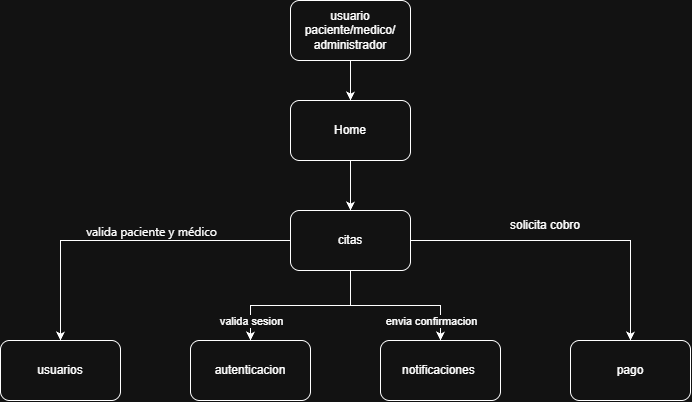

# Gestión de Citas Médicas Distribuida

## Problema que resuelve
Actualmente el consultorio agenda las citas de forma manual (llamadas telefónicas o agenda física), lo que genera cruces de horario, citas duplicadas, olvidos y errores al registrar información. Este sistema centraliza el agendamiento, la confirmación y el recordatorio de citas médicas en una sola plataforma.

## Objetivo
Automatizar y centralizar el proceso de agendamiento y gestión de citas médicas mediante un sistema distribuido, garantizando escalabilidad y eliminando errores humanos en la asignación de horarios.

## Integrantes y Roles
* Daniel Eduardo Lasso: Arquitectura y diagrama.
* Luis Enrique Ruiz: Dockerfile y vista Home.
* Javier Alejandro Guaca: Docker Compose y orquestación de servicios.
* Francisco Javier Galindez: Documentación (README) y definición de APIs.

## Arquitectura del Sistema
Para este proyecto se seleccionó una arquitectura basada en microservicios, porque cada servicio (usuarios, autenticación, citas, notificaciones y pagos) tiene una responsabilidad distinta y puede desarrollarse, desplegarse y escalarse por separado. El servicio de Citas actúa como orquestador principal, ya que es el que más solicita información a los demás servicios para validar y completar una cita.



## Servicios y Responsabilidades
1. Usuarios: Gestionar los datos fundamentales de pacientes (nombre, documento, contacto), médicos (especialidad, horario) y administrativos. Responde a solicitudes del servicio de Citas.
2. Autenticación: Confirmar que quien intenta acceder o agendar (paciente, médico o administrador) está autorizado. Responde a solicitudes del servicio de Citas.
3. Citas: Registrar fechas, horas y estado de las citas. Actúa como orquestador principal del agendamiento y solicita datos a Usuarios, Autenticación y Pagos.
4. Notificaciones: Enviar recordatorios y alertas de confirmación a los usuarios. Recibe peticiones del servicio de Citas.
5. Pagos: Procesar cobros en línea y mantener el registro de transacciones. Responde confirmando o negando información a Citas.

## Comunicación entre Servicios y Definición de APIs
1. Citas a Usuarios (`GET /usuarios/{id}`): Citas solicita validar a un paciente o médico, y Usuarios responde con los datos básicos correspondientes o un error 404 si no existe.
2. Citas a Autenticación (`POST /auth/verificar`): Citas solicita validar el token de sesión del usuario, y Autenticación responde confirmando su validez y el rol del usuario.
3. Citas a Pagos (`POST /pagos/procesar`): Citas solicita procesar el cobro de la consulta, y Pagos responde indicando si la transacción fue aprobada o rechazada.
4. Citas a Notificaciones (`POST /notificaciones/enviar`): Citas solicita el envío de un recordatorio, y Notificaciones responde confirmando que el mensaje fue encolado con éxito.
5. Usuarios a Citas (`GET /citas/usuario/{id}`): Usuarios solicita consultar el historial de un paciente, y Citas responde retornando la lista de citas pasadas y futuras.

## Bases de Datos y Gestión de la Información

### Entidades Principales
* Usuarios: Pacientes (nombre, documento, contacto), médicos (especialidad, horario) y administrativos.
* Citas: Agenda (fecha, hora) y estado de la cita.
* Pagos: Registro de transacciones.

### Usuarios del Sistema
* Paciente
* Médico
* Administrador
* Administrador del sistema

## Riesgos y Fallas Posibles
* Servicio de pagos: No se podrían procesar cobros en línea; la cita quedaría en estado "pendiente de pago" en lugar de bloquear el agendamiento, permitiendo pagar luego en el consultorio.
* Base de datos: Se perdería el acceso a citas, historiales y datos de usuarios; el sistema no podría registrar ni consultar información nueva hasta restaurar el servicio.
* Servidor principal: Todo el sistema quedaría fuera de línea: ni pacientes ni personal podrían agendar, consultar o cancelar citas, obligando a volver temporalmente a métodos manuales.

## Docker
La vista Home (interfaz de inicio) se encuentra contenerizada utilizando Nginx. 

El archivo `Dockerfile` se ubica dentro del directorio `./home` y realiza lo siguiente:
1. Utiliza la imagen base liviana `nginx:alpine`.
2. Copia los archivos `index.html` y `styles.css` al directorio del servidor web `/usr/share/nginx/html/`.
3. Expone el puerto interno `80`.

## Docker Compose
El archivo `docker-compose.yml` orquesta la infraestructura base del proyecto:
1. home: Compila desde `./home`, mapea el puerto host `8080` al puerto contenedor `80` (accesible en `http://localhost:8080`) con el nombre `citas_home`.
2. usuarios, autenticacion, citas, notificaciones, pagos: Servicios declarados mediante imágenes livianas (`alpine`) y un comando pasivo (`tail -f /dev/null`) para mantener los contenedores encendidos como placeholders listos para su posterior desarrollo.

Para levantar la infraestructura completa, ejecuta:

```bash 
docker compose up --build 