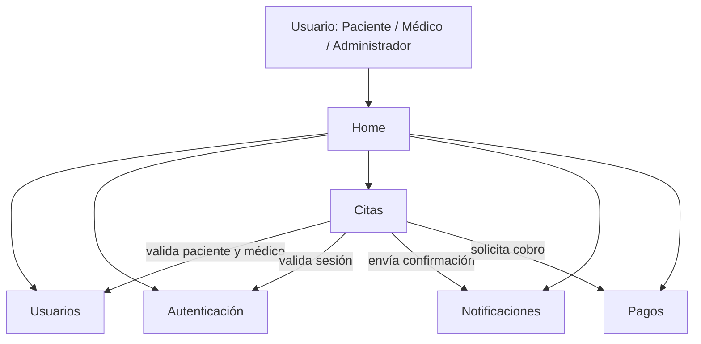

# Arquitectura del sistema — Gestión de Citas Médicas

## Diagrama de arquitectura

Home es lo único que ya está funcionando dentro de un contenedor en este avance. Los demás servicios (Usuarios, Autenticación, Citas, Notificaciones, Pagos) están definidos en Docker Compose, pero su lógica todavía no está implementada.

## Definición de servicios

| Servicio | Responsabilidad | Información que maneja | Se comunica con |
|---|---|---|---|
| Usuarios | Registrar y administrar pacientes, médicos y personal administrativo | Nombre, documento, contacto, especialidad y horario del médico | Citas |
| Autenticación | Validar el inicio de sesión y el acceso según el rol | Credenciales y tokens de sesión | Citas, Usuarios |
| Citas | Agendar, reprogramar, cancelar y consultar disponibilidad | Fecha, hora y estado de la cita | Usuarios, Autenticación, Notificaciones, Pagos |
| Notificaciones | Enviar confirmaciones y recordatorios | Datos de contacto y mensaje a enviar | Citas |
| Pagos | Registrar el pago o copago de la consulta | Estado y monto de la transacción | Citas |

## Comunicación entre servicios

| Quién solicita | Quién responde | Qué se intercambia | Método HTTP |
|---|---|---|---|
| Citas | Usuarios | Validar datos del paciente y del médico | GET |
| Citas | Autenticación | Confirmar que el usuario está autorizado | GET |
| Citas | Notificaciones | Enviar confirmación o recordatorio | POST |
| Citas | Pagos | Solicitar o confirmar el cobro | POST |

## Estado actual

- **Implementado:** vista Home, ejecutándose en un contenedor.
- **Definido pero pendiente de lógica:** Usuarios, Autenticación, Citas, Notificaciones, Pagos (ya están en el `docker-compose.yml`).
